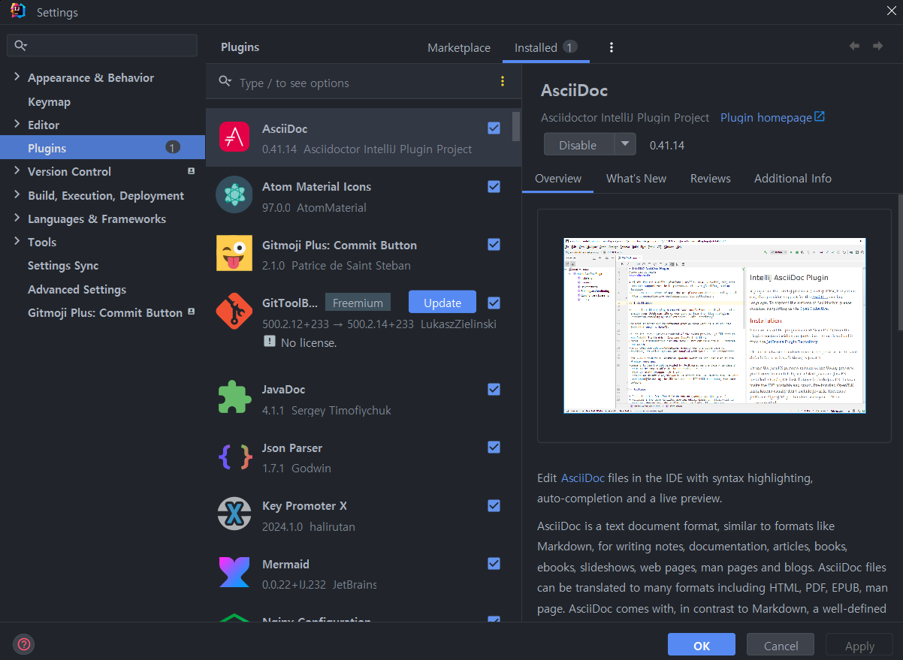

# [섹션 #1] 테스트는 왜 필요할까?

## 단위 테스트(Unit test)

- **작은** 코드 단위를 **독립적**으로 검증하는 테스트
- 검증 속도가 빠르고 안정적이다.

### JUnit 5

- 단위 테스트를 위한 테스트 프레임워크
- XUnit - Kent Beck
    - SUnit(Smalltalk), JUnit(Java), NUnit(.NET)

### AssertJ

- 테스트 코드 작성을 원활하게 돕는 테스트 라이브러리
- 풍부한 API, 메서드 체이닝 지원

### 테스트가 어려운 영역을 구분하고 분리

- 주문은 10~22시 사이에만 가능
- 위의 요구사항에 대하여
- 테스트하기 어려운 영역을 구분하고 분리할 필요
- 외부로 분리할수록 테스트 가능한 코드는 많아진다.


- **테스트하기 어려운 영역**
    - 관측할 때마다 다른 값에 의존하는 코드
        - 현재 날짜/시간, 랜덤 값, 전역 변수/함수, 사용자 입력 등
    - 외부 세계에 영향을 주는 코드
        - 표준 출력, 메시지 발송, 데이터베이스에 기록하기 등

- **순수 함수**
    - 같은 입력에는 항상 같은 결과
    - 외부 세상과 단절된 형태
    - 테스트하기 쉬운 코드

---

# [섹션 #3] TDD: Test Driven Development

## Test Driven Development (TDD)

- 프로덕션 코드보다 테스트 코드를 먼저 작성하여 테스트가 구현 과정을 주도하도록 하는 방법론
- `RED -> GREEN -> REFACTOR` -> RED Cycle
- RED: 실패하는 테스트 작성
- GREEN: 테스트 통과 최소한의 코딩
- REFACTOR: 구현 코드 개선 테스트 통과 유지

### 피드백

- 선 기능 구현, 후 테스트 작성
    - 테스트 자체의 누락 가능성
    - 특정 테스트(해피 케이스) 케이스만 검증할 가능성
    - 잘못된 구현을 다소 늦게 발견할 가능성


- **선 테스트 작성, 후 기능 구현**
    - 복잡도가 낮은, 테스트 가능한 코드로 구현할 수 있게 한다.
    - 쉽게 발견하기 어려운 엣지(Edge) 케이스를 놓치지 않게 해준다.
    - 구현에 대한 빠른 피드백을 받을 수 있다.
    - 과감한 리팩토링이 가능해진다.

### TDD: 관점의 변화

- BEFORE: 테스트는 구현부 검증을 위한 보조 수단
- AFTER: 테스트와 상호 작용하며 발전하는 구현부
- 클라이언트 관점에서의 피드백을 주는 Test Driven

### 키워드 정리

- TDD
- `RED -> GREEN -> REFACTOR` Cycle
- 애자일(Agile) 방법론 vs. 폭포수 방법론
- 익스트림 프로그래밍 (XP, eXtreme Programming)
- 스크럼(Scrum), 칸반(kanban)

---

# [섹션 #4] 테스트는 [ ]다.

### DisplayName 을 섬세하게

- 명사의 나열보다 문장으로 (`다.` 로 끝나게)
- 테스트 행위에 대한 결과까지 기술하기
- 도메인 용어를 사용하여 한층 추상화된 내용을 담기 (메서드 자체의 관점보다 도메인 정책 관점으로)
- 테스트의 현상을 중점으로 기술하지 말 것

### BDD, Behavior Driven Development

- TDD 에서 파생된 개발 방법
- 함수 단위의 테스트에 집중하기보다, 시나리오에 기반한 테스트케이스(TC) 자체에 집주앟여 테스트
- 개발자가 아닌 사람이 봐도 이해할 수 있을 정도의 추상화 수전(레벨)을 권장
- Given / When / Then
    - `Given`: 시나리오 진행에 필요한 모든 준비 과정 (객체, 값, 상태 등)
    - `When`: 시나리오 행동 진행
    - `Then`: 시나리오 진행에 대한 결과 명시, 검증
  > DisplayName 을 명확하게 작성할 수 있다.

### 키워드 정리

- `@DisplayName` - 도메인 정책, 용어를 사용한 명확한 문장
- Given / When / Then - 주어진 환경, 행동, 상태 변화
- TDD vs. BDD
- JUnit vs Spock
    - Spock: Given / When / Then 을 나눈 BDD Framework

# [섹션 #5] Spring & JPA 기반 테스트

## Layered Architecture

관심사의 분리

`User ⇔ Presentation ⇔ Business ⇔ Persistence ⇔ Data`

### 통합 테스트

- 여러 모듈이 협력하는 기능을 통합적으로 검증하는 테스트
- 일반적으로 작은 범위의 단위 테스트만으로는 기능 전체의 신뢰성을 보장할 수 없음
- 풍부한 단위 테스트 & 큰 기능 단위를 검증하는 통합 테스트

## Mock

https://site.mockito.org

### MockMvc

Mock(가짜) 객체를 사용해 스프링 MVC 동작을 재현할 수 있는 프레임워크

## 키워드 정리

### Layered Architecture

Layered Architecture는 소프트웨어를 여러 계층(Layer)으로 나누어 구성하는 아키텍처 스타일  
각 계층은 특정한 역할과 책임을 가지며, 일반적으로 상위 계층이 하위 계층을 의존하거나 호출하는 방식으로 동작  
이 아키텍처는 시스템을 이해하기 쉽게 만들고, 각각의 계층에 대한 독립적인 테스트와 유지보수가 가능하도록 합니다.

- Entity 객체가 DB와 너무 강결합
- JPA 와 너무 깊게 결합되어 있음
- JPA 엔터티가 Presentation Layer나 Application Layer에 노출되면 모델이 오염될 수 있음
- 계층 간의 강한 의존성으로 인해, 하위 계층의 변경이 상위 계층에 영향을 줄 수 있음
- 애플리케이션이 복잡해지면 계층 간의 커뮤니케이션이 복잡해질 수 있음

### Hexagonal Architecture


[Hexagonal Architecture Lecture](https://www.youtube.com/watch?v=qGp66Oc3zTg)

Hexagonal Architecture는 애플리케이션의 핵심 비즈니스 로직을 외부 세계(사용자 인터페이스, 데이터베이스, 외부 서비스 등)와 독립적으로 설계하기 위한 아키텍처 스타일  
애플리케이션의 내부 도메인 로직을 외부 환경으로부터 격리하여 유연성을 높이는 것이 목표

- 비즈니스 로직이 외부 기술에 의존하지 않기 때문에 높은 유연성과 테스트 용이성을 가집니다.
- 다양한 클라이언트(UI, API 등)에 동일한 도메인 로직을 재사용할 수 있습니다.
- 외부 시스템의 변경이 Core에 미치는 영향을 최소화할 수 있습니다.
- 구조가 상대적으로 복잡할 수 있으며, 이해하는 데 시간이 걸릴 수 있습니다.
- 작은 프로젝트에서는 과도한 설계가 될 수 있습니다.

### Layered Architecture vs Hexagonal Architecture 비교

- 의존성: Layered Architecture는 계층 간의 상하 의존성이 있지만, Hexagonal Architecture는 의존성을 역전시켜 외부 시스템이 Core를 참조하도록 설계됩니다.
- 유연성: Hexagonal Architecture는 외부 시스템과의 독립성을 강조하므로 변화에 더 유연하게 대처할 수 있습니다.
- 테스트 용이성: Hexagonal Architecture는 Core와 외부 시스템이 분리되어 있으므로, Core를 독립적으로 테스트하기가 더 쉽습니다.

# [섹션 #6] Mock 을 마주하는 자세

### Mockito Stubbing

- Mock 을 이용하여 외부 통신이나 DB 연결 등의 작업을 수행
- MockMvc의 `when` -> `thenReturn`
- 외부와의 연결 없이도 테스트가 가능해 짐

### Test Double

- **Dummy**
    - 아무 것도 하지 않는 깡통 객체
- **Fake**
    - 단순한 형태로 동일한 기능은 수행하나, 프로덕션에서 쓰기에는 부족한 객체
    - `FakeRepository`
- **Stub**
    - 테스트에서 요청한 것에 대해 미리 준비한 결과를 제공하는 객체 그 외에는 응답하지 않는다.
- **Spy**
    - Stub 이면서 호출된 내용을 기록하여 보여줄 수 있는 객체
    - 일부는 실제 객체처럼 동작시키고 일부만 Stubbing 할 수 있다.
- **Mock**
    - 행위에 대한 기대를 명시하고, 그에 따라 동작하도록 만들어진 객체

> Mock 과 Stub의 차이
> - [Test Double](https://martinfowler.com/articles/mocksArentStubs.html)
> - Stub 같은 경우는 어떤 기능을 요청했을 떄 Stub 의 **상태를 기록 및 검증** 하는데 초점
> - Mock 은 행위에 대해 검증을 중점

### @Mock, @Spy, @InjectMock

- `@Mock`: `MailServiceMockTest`
- `@Spy`: `MailServiceSpyTest`

### BDD Mockito

- `MailServiceBDDMockitoTest`

### Classicist vs. Mockist

- Classicist 는 최대한 기능을 Mock 하지말고 테스트를 하자는 주의
- Mockist 는 이미 동작 테스트가 완료된 기능에 대해서는 Mock 을 사용해서 테스트

# [섹션 #7] 더 나은 테스트를 작성하기 위한 구체적 조언

## @ParameterizedTest

[](https://junit.org/junit5/docs/current/user-guide/#writing-tests-parameterized-tests)

- 매개변수화된 검정을 사용하면 서로 다른 검정을 여러 번 실행할 수 있습니다
- Source 로는 `@CsvSource`와 `@MethodSource`가 많이 사용된다.

```java

@DisplayName("상품 타입이 재고 관련 타입인지 체크한다.")
@CsvSource({"HANDMADE, false", "BOTTLE, true", "BAKERY, true"})
@ParameterizedTest
void containsStockType3(ProductType productType, boolean expected) {
    // when
    boolean result = ProductType.containsStockType(productType);

    // then
    assertThat(result).isEqualTo(expected);
}

private static Stream<Arguments> provideProductTypesForCheckingStockType() {
    return Stream.of(
            Arguments.of(ProductType.HANDMADE, false),
            Arguments.of(ProductType.BOTTLE, true),
            Arguments.of(ProductType.BAKERY, true)
    );
}
```

```java

@DisplayName("상품 타입이 재고 관련 타입인지를 확인한다.")
@MethodSource("provideProductTypesForCheckingStockType")
@ParameterizedTest
void containsStockType4(ProductType productType, boolean expected) {
    // when
    boolean result = ProductType.containsStockType(productType);

    // then
    assertThat(result).isEqualTo(expected);
}
```

## @DynamicTest

- 단계별로 테스트하는 것이 유리할 때 사용할 수 있다.

```java

@DisplayName("재고 차감 시나리오")
@TestFactory
Collection<DynamicTest> stockDeductionDynamicTest() {
    // given
    Stock stock = Stock.create("001", 1);

    return List.of(
            DynamicTest.dynamicTest("재고를 주어진 개수만큼 차감할 수 있다.", () -> {
                // given
                int quantity = 1;

                // when
                stock.deductQuantity(quantity);

                // then
                assertThat(stock.getQuantity()).isZero();
            }),
            DynamicTest.dynamicTest("재고보다 많은 수의 수량으로 차감 시도하는 경우 예외가 발생한다.", () -> {
                // given
                int quantity = 1;

                // when, then
                assertThatThrownBy(() -> stock.deductQuantity(quantity))
                        .isInstanceOf(IllegalArgumentException.class)
                        .hasMessage("차감할 재고 수량이 없습니다.");
            })
    );
}
```

## 환경 통합으로 테스트 비용 감소

- 테스트 환경이 달라지면 Spring 은 서버를 재시작하게 된다.
- 서버의 재시작은 곧 시간을 소모한다.
- 불필요한 서버 재시작을 막기 위해서는 테스트 환경을 통합하는 것이 효과적이다.

### @SpringBootTest 의 통합

```java

@ActiveProfiles("test")
@SpringBootTest
public abstract class IntegrationTestSupport {
    @MockBean
    protected MailSendClient mailSendClient;
}
```

- `@SpringBootTest` 를 사용하는 테스트의 환경을 통합
- Mock 객체를 사용하는 `@MockBean` 객체 또한 서버 환경을 달라지게 하므로 통합
- `@DataJpaTest` 는 `@Transaction` 어노테이션을 자동으로 지원하는 등의 장점이 있지만 `@SpringBootTest`는 `@DataJpaTest` 기능을 거의 대부분 포함한다.
- 따라서, 테스트 환경의 통합을 위해서는 `@DataJpaTest`의 사용을 지양할 필요가 있다.

### @WebMvcTest 의 통합

- `Controller` Test 를 위해 WebMvcTest 를 활용해 왔다.

```java

@WebMvcTest(controllers = {
        OrderController.class,
        ProductController.class
})
public abstract class ControllerTestSupport {
    @Autowired
    protected MockMvc mockMvc;
    @Autowired
    protected ObjectMapper objectMapper;
    @MockBean
    protected OrderService orderService;
    @MockBean
    protected ProductService productService;
}
```

- WebMvcTest 의 Controller 가 사용하는 의존성을 공통으로 생성
- 하위 클래스에서 사용하기 위해 `protected` 가 필수

## 키워드 정리

- 테스트 하나 당 목적은 하나!
- 완벽한 제어
    - 테스트 코드내에서의 LocalDateTime 의 사용 같은 경우를 피하자
    - 정확한 시간을 지정 (test와 production 환경의 차이 발생 가능)
- 테스트 환경의 독립성, 테스트 간 독립성
- Test Fixture
- `deleteAll`, `deleteAllInBatch`
- `@ParameterizedTest`, `DynamicTest`
- 수행 환경 통합
- private method test
    - 만들 필요가 없음
    - 다른 production method 로 충분히 검증이 됨
- 테스트에서만 필요한 코드
    - 만들어도 되지만 충분한 근거를 갖자
    - 예를 들면, 미래 시점에 충분히 사용될 수 있는 코드 (ex: `size()`)

# [섹션 #8] Appendix

## google/guava 라이브러리

[](https://github.com/google/guava)

- `Lists.partition`
- `MultiMap`

Test 코드를 활용하여 위와 같은 라이브러리를 학습할 수 있음

## Spring REST Docs

- 테스트 코드를 통한 API 문서 자동화 도구
- API 명세를 문서로 만들고 외부에 제공함으로써 협업을 원활하게 한다.
- 기본적으로 AsciiDoc 을 사용하여 문서를 작성한다.
- **장점**
    - 테스트를 통과해야 문서가 만들어진다. (신뢰도가 높다.)
    - 프로덕션 코드에 비침투적이다.
- **단점**
    - 코드 양이 많다.
    - 설정이 어렵다.

### Swagger

- **장점**
    - 적용이 쉽다.
    - 문서에서 바로 API 호출을 수행해볼 수 있다.
- **단점**
    - 프로덕션 코드에 침투적이다.
    - 테스트와 무관하기 때문에 신뢰도가 떨어질 수 있다.

### Rest Docs 실습

[Asciidoctor](https://asciidoctor.org/)
[Spring Rest Doc](https://docs.spring.io/spring-restdocs/docs/current/reference/htmlsingle/)

- Intellij Plugin 설치
  
    - **AsciiDoc** 이라는 Plugin 설치
    - AsciiDoc 문서의 미리보기

1. `build.gradle` plugin에 Asciidoctor plugin 추가
    ```
    id 'org.asciidoctor.jvm.convert' version '3.3.2'
    ```
2. `build.gradle` configurations 에 `asciidoctorExt` 추가
    ```
    configurations {
        compileOnly {
            extendsFrom annotationProcessor
        }
        asciidoctorExt
    }
    ```
3. 전역 변수
    ```
    ext {
       snippetsDir = file('build/generated-snippets') // snippet 의 dir 정의
    }
    ```

4. 테스트 결과물을 snippetsDir 로 저장
    ```
    test {
       outputs.dir snippetsDir
    }
    ```

5. asciidoctor 를 test 수행후 실행(문서 생성)되도록 지정
    ```
    asciidoctor {
        inputs.dir snippetsDir
        configurations 'asciidoctorExt'
        
        dependsOn test
    }
    ```

6. 문서를 정적파일로 보기 위해 static 폴더로 복사하는 작업
    ```
    bootJar {
        dependsOn asciidoctor
        from("${asciidoctor.outputDir}") {
            into 'static/docs'
        }
    }
    ```
7. RestDoc 작성을 위한 Support Class 생성
    ```java
    @ExtendWith(RestDocumentationExtension.class)
    public abstract class RestDocsSupport {
        protected MockMvc mockMvc;
    
        @BeforeEach
        void setUp(RestDocumentationContextProvider provider) {
            this.mockMvc = MockMvcBuilders.standaloneSetup(initController())
                    .apply(MockMvcRestDocumentation.documentationConfiguration(provider))
                    .build();
        }
    
        protected abstract Object initController();
    }
    ```
    - `initController` 메서들 통해 하위 `Controller` Test Class 로 부터 Controller 를 주입
    - `@SpringBootTest` 를 사용하고 `WebApplicationContext` 를 주입받아서 생성할 수도 있음
      ```java
       @ExtendWith(RestDocumentationExtension.class)
       @SpringBootTest
       public abstract class RestDocsSupport {
       protected MockMvc mockMvc;
       
           @BeforeEach
           void setUp(WebApplicationContext webApplicationContext,
                      RestDocumentationContextProvider provider) {
               this.mockMvc = MockMvcBuilders.standaloneSetup(webApplicationContext)
                       .apply(MockMvcRestDocumentation.documentationConfiguration(provider))
                       .build();
           }
       }
      ```
        - 하지만 위의 방법을 사용할 경우 `RestDoc` 생성을 위해 서버가 재시작 됨

8. RestDoc 작성을 위한 Controller Test Class 작성
    ```java
    public class ProductControllerDocsTest extends RestDocsSupport {
        private final ProductService productService = mock(ProductService.class);
        @Override
        protected Object initController() {
            return new ProductController(productService);
        }
    }
    ```
   - `bean` 객체는 `mock` 을 이용하여 생성
9. `ProductControllerDocsTest` 클래스 완성하기
```java
public class ProductControllerDocsTest extends RestDocsSupport {
    private final ProductService productService = mock(ProductService.class);

    @Override
    protected Object initController() {
        return new ProductController(productService);
    }

    @DisplayName("신규 상품을 등록하는 API")
    @Test
    void createProduct() throws Exception {
        ProductCreateRequest request = ProductCreateRequest.builder()
                .type(ProductType.HANDMADE)
                .sellingStatus(ProductSellingStatus.SELLING)
                .name("아메리카노")
                .price(4000)
                .build();

        given(productService.createProduct(any(ProductCreateServiceRequest.class)))
                .willReturn(ProductResponse.builder()
                        .id(1L)
                        .productNumber("001")
                        .type(ProductType.BOTTLE)
                        .sellingStatus(ProductSellingStatus.SELLING)
                        .name("아메리카노")
                        .price(4000)
                        .build());

        mockMvc.perform(post("/api/v1/products/new")
                        .content(objectMapper.writeValueAsString(request))
                        .contentType(MediaType.APPLICATION_JSON)
                )
                .andDo(print())
                .andExpect(status().isOk())
                // RestDoc 문서 작성부
                .andDo(document("product-create",
                        preprocessRequest(prettyPrint()),
                        preprocessResponse(prettyPrint()),
                        requestFields(
                                fieldWithPath("type").type(JsonFieldType.STRING).description("상품 타입"),
                                fieldWithPath("sellingStatus").type(JsonFieldType.STRING).optional().description("상품 판매 상태"),
                                fieldWithPath("name").type(JsonFieldType.STRING).description("상품 이름"),
                                fieldWithPath("price").type(JsonFieldType.NUMBER).description("상품 가격")
                        ),
                        responseFields(
                                fieldWithPath("code").type(JsonFieldType.NUMBER).description("코드"),
                                fieldWithPath("status").type(JsonFieldType.STRING).description("상태"),
                                fieldWithPath("message").type(JsonFieldType.STRING).description("메시지"),
                                fieldWithPath("data").type(JsonFieldType.OBJECT).description("응답 데이터"),
                                fieldWithPath("data.id").type(JsonFieldType.NUMBER).description("상품 ID"),
                                fieldWithPath("data.productNumber").type(JsonFieldType.STRING).description("상품 번호"),
                                fieldWithPath("data.type").type(JsonFieldType.STRING).description("상품 타입"),
                                fieldWithPath("data.sellingStatus").type(JsonFieldType.STRING).description("상품 판매 상태"),
                                fieldWithPath("data.name").type(JsonFieldType.STRING).description("상품 이름"),
                                fieldWithPath("data.price").type(JsonFieldType.NUMBER).description("상품 가격")
                        )));
    }
}

```
- 테스트 코드 작성은 일반적인 `WebMvcTest`와 다르지 않다.
- `productService`는 Mock 객체이므로 `createProduct`의 Reponse 를 BDDMock 으로 생성
- 테스트의 `then` 절에 해당하는 부분의 마지막에 `andDo` 라는 부분부터 `RestDoc` 을 작성하는 부분
- `document`: 해당하는 Test 의 `id`
- `preprocessRequest(prettyPrint())`, `preprocessResponse(prettyPrint())`: `json` 을 예쁘게 표시
- `requestFields`, `responseFields`: Request, Response 로 오는 객체를 정의
  - `fieldWithPath`: 객체의 하위 파라미터들을 정의
  - `type`, `optional`, `description` 을 정의할 수 있다.
  - `object` 내의 하위 파라미터들은 `obj-name.param` 형식으로 생성하면 된다.

10. 테스트를 실행하고 `build/generated-snippets` 를 보면 파일들이 생성된 것을 볼 수 있다.
11. 프로젝트의 `src` 폴더 밑에 `src/docs/asciidoc` 위치에 `index.adoc` 을 생성
    ```asciidoc
    ifndef::snippets[]
    :snippets: ../../build/generated-snippets
    endif::[]
    = CafeKiosk REST API 문서
    :doctype: book
    :icons: font
    :source-highlighter: highlightjs
    :toc: left
    :toclevels: 2
    :sectlinks:
    
    [[product-create]]
    === 신규 상품 등록
    
    ==== HTTP Request
    include::{snippets}/product-create/http-request.adoc[]
    include::{snippets}/product-create/request-fields.adoc[]
    
    ==== HTTP Response
    include::{snippets}/product-create/http-response.adoc[]
    include::{snippets}/product-create/response-fields.adoc[]
    ```
    으로 `asciidoc` 을 생성
12. gradle -> documentation -> asciidoctor 을 실행
13. `build/docs/asciidoc` 에 `index.html` 을 보면 RestDoc 문서가 생성된 것을 볼 수 있다.
14. 서버 실행해 보기
- `./gradlew build` 로 서버 빌드
- `build/libs`의 실행 파일을 실행
- `java -jar ***.jar` 로 서버를 실행
- `http://localhost:8080/docs/index.html` 접속으로 문서를 확인

### RestDoc 개선
1. RestDoc 커스텀
- 위의 RestDoc 문서를 만드는 부분의 `fieldWithPath` 옵션에는 `optional()` 이라는 메서드가 존재한다.
- 하지만 생성된 문서를 보면 optional 에 대한 부분은 확인이 어렵다 이런 것을 개선하고 또 원하는 대로 문서를 커스텀할 수 있다.
- `test/resources/org/springframework/restdocs/templates` 경로로 디렉토리를 생성한다.
- 하위에 `request-fields.snippet` 과 `response-fields.snippet` 폴더를 생성하고
    ```asciidoc
    ==== Response Fields
    |===
    |Path|Type|Optional|Description
    
    {{#fields}}
    
    |{{#tableCellContent}}`+{{path}}+`{{/tableCellContent}}
    |{{#tableCellContent}}`+{{type}}+`{{/tableCellContent}}
    |{{#tableCellContent}}{{#optional}}O{{/optional}}{{/tableCellContent}}
    |{{#tableCellContent}}{{description}}{{/tableCellContent}}
    
    {{/fields}}
    
    |===
    ```
    - 위와 같이 RestDoc 을 커스텀할 수 있다.

2. `asciidoc` 문서 분리하기
- 문서의 가독성을 위해 분리하여 작성하는 것이 좋다.
- `src/docs/asciidoc/index.adoc` 의 파일을 아래와 같이 변경
    ```asciidoc
    ifndef::snippets[]
    :snippets: ../../build/generated-snippets
    endif::[]
    = CafeKiosk REST API 문서
    :doctype: book
    :icons: font
    :source-highlighter: highlightjs
    :toc: left
    :toclevels: 2
    :sectlinks:
    
    [[Product-API]]
    == Product API
    
    include::api/product/product.adoc[]
    ```
- `asciidoc` 하위에 `api/product` 디렉토리를 생성하고 `product.adoc` 문서를 생성
    ```asciidoc
    [[product-create]]
    === 신규 상품 등록
    
    ==== HTTP Request
    include::{snippets}/product-create/http-request.adoc[]
    include::{snippets}/product-create/request-fields.adoc[]
    
    ==== HTTP Response
    include::{snippets}/product-create/http-response.adoc[]
    include::{snippets}/product-create/response-fields.adoc[]
    ```
- `build.gradle` 수정
    ```
    asciidoctor {
        inputs.dir snippetsDir
        configurations 'asciidoctorExt'
    
        sources { // 특정 파일만 html 로 만든다.
            include("**/index.adoc")
        }
        baseDirFollowsSourceFile() // 다른 ado 파일을 include 할 때 경로를 baseDir 로 맞춘다.
        dependsOn test
    }
    ```